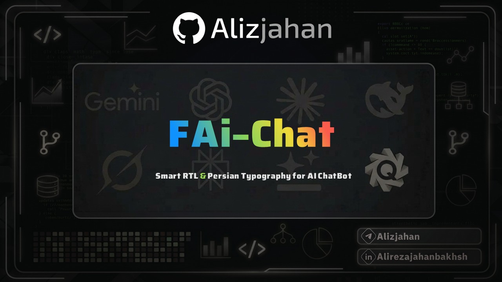

<p align="center">
  
</p>

<p align="center">
  <strong>Smart RTL Direction, Multilingual Interface (Persian, Arabic, English) & Typography for AI Chatbots</strong>
</p>

<p align="center">
  <a href="https://github.com/Alizjahan/FAi-Chat"></a>
  <a href="https://github.com/Alizjahan/FAi-Chat"></a>
  <a href="https://github.com/Alizjahan/FAi-Chat/blob/main/LICENSE"></a>
  <a href="https://github.com/Alizjahan"></a>
</p>

---

## Overview

FAi-Chat-bot-RTL-Persian-Arabic is a modern browser extension built on Chrome Manifest V3, engineered to deliver intelligent right-to-left (RTL) text layout, bidirectional sentence processing, and Persian & Arabic typography across all leading AI conversational platforms and LLM interfaces.

Equipped with a built-in trilingual UI switcher (Persian, Arabic, and English), native font support for Dubai, Vazirmatn, and Snapp, and mutation-driven DOM observation, the extension ensures flawless mixed-language rendering without interfering with code blocks, math formulas, or markdown structures.

---

## Key Highlights

- **Trilingual Interface**: Instant one-click language switching between Persian (فارسی), Arabic (العربية), and English with automatic layout adaptation (RTL/LTR).
- **Arabic & Persian Typography**: Native embedded web fonts including **Dubai** (for Arabic and Persian users), **Vazirmatn**, and **Snapp**, alongside full support for local system fonts.
- **Dynamic Direction Detection**: Real-time analysis of streaming AI responses with automated direction assignment based on linguistic composition.
- **Syntactic Code Isolation**: Code snippets, terminal blocks, preformatted tags, and LaTeX notation remain strictly left-to-right (LTR) with intact indentation.
- **Per-Platform Granular Toggles**: Granular activation controls covering more than 50 artificial intelligence interfaces and developer workbenches.
- **Pixel-Accurate Font Resizing**: Custom slider for live font scaling from 12px to 24px with one-click default reset.
- **Modern User Interface**: Native popup console supporting dynamic dark, light, and Antigravity color palettes.
- **Zero External Telemetry**: Offline-first architecture operating exclusively within client-side permissions without external tracking endpoints.

---

## Supported Platforms

FAi-Chat-bot-RTL-Persian-Arabic provides tailored compatibility rules and CSS bindings for major AI platforms, including:

| Category | Platforms |
| :--- | :--- |
| **Conversational LLMs** | ChatGPT, Claude, Google Gemini, DeepSeek, Grok, Microsoft Copilot, GitHub Copilot Chat, Perplexity AI, Poe, Mistral AI, Qwen, Kimi, Manus, Monica |
| **Research & Workspace** | NotebookLM, Google AI Studio, OpenRouter, LMSYS Chatbot Arena, Consensus, SciSpace, Elicit, Notion AI, Cursor |
| **Creative & Generation** | Lovable.dev, Gamma App, Writesonic, TypingMind, Chatbox AI, HuggingChat, Meta AI, Character.AI, Blackbox AI |

---

## Architecture & Technical Stack

```
FAi-Chat-bot-RTL-Persian-Arabic/
├── manifest.json              # Chrome Manifest V3 configuration
├── index.html                 # Extension popup interface
├── popup.css                  # UI layout and thematic token styles
├── popup.js                   # Client state management, i18n & messaging controller
├── style.css                  # Global injected stylesheet for RTL & Typography
├── js/
│   ├── background.js          # Service worker lifecycle & tabs broadcasting
│   ├── content.js             # Core RTL detection & mutation observer engine
│   ├── manual-rtl.js          # Manual direction toggling controller
│   └── myJquery-3.7.1.js      # DOM utility helper
├── css/
│   ├── vazir.css              # Vazirmatn font-face definitions
│   ├── snapp.css              # Snapp font-face definitions
│   ├── dubai.css              # Dubai font-face definitions
│   └── fontiran-iranyekan.css # IranYekan definitions
├── fonts/                     # Bundled web fonts and font registry metadata
│   ├── fonts.json
│   ├── dubai/                 # Dubai Regular, Bold, Medium, Light
│   ├── snapp/
│   └── vazir/
└── images/                    # Extension and supported platform icons
```

---

## Installation & Development Setup

### Manual Installation (Developer Mode)

1. Clone or download this repository to your local workstation:
   ```bash
   git clone https://github.com/Alizjahan/FAi-Chat.git
   ```
2. Open Google Chrome (or any Chromium-based browser) and navigate to:
   ```
   chrome://extensions/
   ```
3. Enable **Developer mode** in the top right corner.
4. Click on **Load unpacked** in the top left toolbar.
5. Select the project directory (`Persian_RTL_new_ui`).
6. The extension is now loaded and available via the browser extensions menu.

---

## Configuration & Storage Schema

Settings are synchronized across browser sessions using `chrome.storage.sync`. Key configuration fields include:

- `globalEnabled` *(boolean)*: Global extension activation toggle.
- `uiLang` *(string)*: Active user interface language (`fa`, `ar`, `en`).
- `selectedFont` *(string)*: Active typeface identifier (`vazir`, `snapp`, `dubai`, `custom_system`).
- `customFontName` *(string)*: Name of the local system font when custom mode is selected.
- `fontScale` / `fontScalePx` *(number)*: Font size scale in pixels (range: 12px – 24px).
- `rtlAlgorithmMode` *(string)*: Text analysis mode (`advanced_full`, `advanced_section`, `first_word`).
- `uiTheme` *(string)*: Popup color scheme (`dark`, `light`, `antigravity`).
- `[platformKey]` *(boolean)*: Individual toggle status for each supported site.

---

## Releases & Versioning

| Version | Release Milestone | Details |
| :--- | :--- | :--- |
| **v1.1.0** | Trilingual & Arabic Font Release | Added trilingual UI switcher (Persian, Arabic, English), integrated Dubai font family, improved RTL/LTR adaptive styles. |
| **v1.0.0** | Stable Production Release | Clean UI overhaul, pixel-based font scale, Snapp & Vazirmatn integration, 54 platform mappings. |
| **v0.8.0** | Comprehensive Platform Expansion | Expanded site coverage (NotebookLM, Lovable, Grok, Kimi), live font preview pipeline. |
| **v0.5.0** | Bidirectional Text Algorithm | Integrated advanced sentence-level mixed language analyzer and arrow mirror mechanism. |
| **v0.3.0** | Typography & Font Engine | Added system font picker fallback and custom web font stylesheet injection. |
| **v0.1.0** | Core Architecture Initialization | Baseline Manifest V3 foundation, background service worker, and basic mutation observer. |

---

## License

This project is licensed under the [MIT License](LICENSE).

---

## Maintainer

**Alireza Jahanbakhsh**
- GitHub: [@Alizjahan](https://github.com/Alizjahan)
- LinkedIn: [Alirezajahanbakhsh](https://linkedin.com/in/Alirezajahanbakhsh)
- Telegram: [@Alizjahan](https://t.me/Alizjahan)
