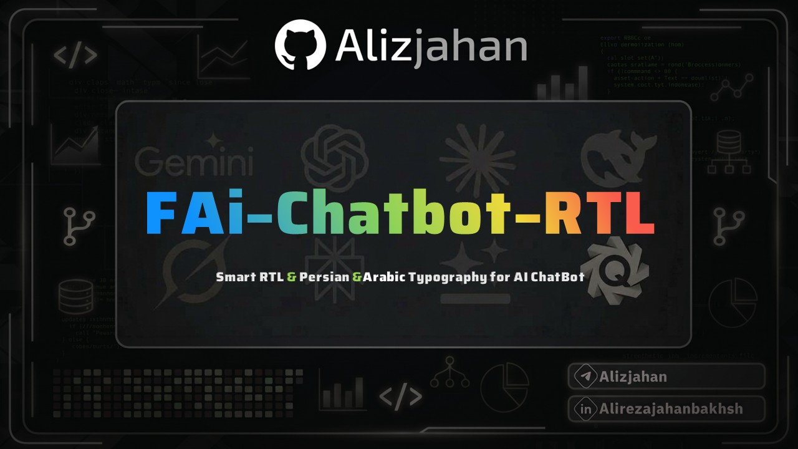

<p align="center">
  
</p>

# راهنمای افزونه FAi-Chatbot-RTL-Persian-Arabic

افزونه **FAi-Chatbot-RTL-Persian-Arabic** جهت راست‌چین‌سازی هوشمند (RTL)، تصحیح چیدمان متون دوجهته و اعمال تایپوگرافی استاندارد فارسی و عربی برای چت‌بات‌ها و پلتفرم‌های گفتگوی هوش مصنوعی بر پایه Manifest V3 مرورگر کروم توسعه یافته است.

[English Documentation](./README.md) | [راهنمای فارسی](./README_FA.md) | [الدليل العربي](./README_AR.md)

---

## 🎯 تفکیک هوشمند متون و کدهای برنامه‌نویسی

یکی از بزرگ‌ترین چالش‌ها در چت‌بات‌های هوش مصنوعی، به‌هم‌ریختگی متون ترکیبی فارسی/عربی با کدهای برنامه‌نویسی است. افزونه FAi-Chatbot-RTL-Persian-Arabic با استفاده از موتور دقیق استایل‌دهی و پردازش لحظه‌ای:

- **بخش‌های تحت پوشش افزونه**:
  - پیام‌های ارسالی کاربر (User Prompts)
  - پاسخ‌های دستیار هوش مصنوعی (AI Responses)
  - کادر ورود متن و پرامپت (Chat Input Box)
  - عنوان‌ها، پاراگراف‌ها، نقل‌قول‌ها و لیست‌های درون چت
- **بخش‌هایی که کاملاً استاندارد و چپ‌چین (LTR) باقی می‌مانند**:
  - بلوک‌های کد (`pre` و `code`)
  - فرمول‌های ریاضی و کدهای LaTeX
  - جدول‌های داده‌ای انگلیسی و نام متغیرها
  - دکمه‌های کپی و کنترل پنل‌ها

---

## ✨ قابلیت‌های کلیدی

- **فونت‌های تعبیه‌شده آفلاین (Offline Fonts)**:
  - **فونت دبی (Dubai Font)**: فونت رسمی، مدرن و خوانا برای متون فارسی و عربی به صورت کاملاً آفلاین و بهینه.
  - **فونت متغیر وزیرمتن (Vazirmatn Variable)**: قلم استاندارد و دقیق تعبیه‌شده در بسته افزونه با فرمت WOFF2.
  - **فونت اسنپ (Snapp)**: قلم مدرن و چشم‌نواز فارسی تعبیه‌شده در اکستنشن.
  - **پشتیبانی از فونت‌های سیستمی**: امکان انتخاب سریع هر یک از فونت‌های نصب‌شده روی سیستم‌عامل (ایران‌یکان، تاهوما، بی نازنین و ...).
- **رابط کاربری ۳ زبانه (فارسی | عربی | انگلیسی)**:
  - دکمه تغییر زبان کپسولی با آیکون کره زمین (`[FA 🌐]` / `[AR 🌐]` / `[EN 🌐]`) برای تغییر زبان و جهت پنل با یک کلیک.
- **تغییر دقیق اندازه فونت با پیکسل (px)**:
  - اسلایدر تنظیم اندازه قلم از 12px تا 24px همراه با دکمه بازنشانی سریع به حالت پیش‌فرض (16px).
- **موتور تشخیص هوشمند جهت متن**:
  - تحلیل آنی جملات استریم‌شده با امکان انتخاب الگوریتم‌های مختلف پردازش متن.
- **پشتیبانی از بیش از ۵۰ سرویس هوش مصنوعی**:
  - سوئیچ‌های تفکیک‌شده برای فعال یا غیرفعال کردن اکستنشن در هر یک از چت‌بات‌ها (ChatGPT, Claude, Gemini, DeepSeek, Grok, NotebookLM و ...).
- **تم‌های مدرن تاریک، روشن و آنتی‌گرویتی**:
  - پالت رنگی حرفه‌ای متناسب با سلیقه کاربر با امکان تغییر آنی.
- **کاملاً آفلاین و امن**:
  - بدون ارسال هرگونه تله‌متری، لاگ یا درخواست خارجی به سرورها.

---

## 🌐 سرویس‌های تحت پوشش

| دسته‌بندی | پلتفرم‌های پشتیبانی‌شده |
| :--- | :--- |
| **چت‌بات‌های گفتگو** | ChatGPT, Claude, Google Gemini, DeepSeek, Grok, Microsoft Copilot, GitHub Copilot Chat, Perplexity AI, Poe, Mistral AI, Qwen, Kimi, Manus, Monica |
| **محیط‌های پژوهشی و ابزارها** | NotebookLM, Google AI Studio, OpenRouter, LMSYS Chatbot Arena, Consensus, SciSpace, Elicit, Notion AI, Cursor |
| **ابزارهای خلاقانه و کدنویسی** | Lovable.dev, Gamma App, Writesonic, TypingMind, Chatbox AI, HuggingChat, Meta AI, Character.AI, Blackbox AI |

---

## 🚀 روش نصب

### نصب دستی در مرورگر کروم و مرورگرهای مبتنی بر کرومیوم:
۱. ریپازیتوری را دانلود یا کلون نمایید:
   ```bash
   git clone https://github.com/Alizjahan/FAi-Chatbot-RTL-Persian-Arabic.git
   ```
۲. در مرورگر کروم آدرس زیر را باز کنید:
   ```
   chrome://extensions/
   ```
۳. گزینه **Developer mode** را در گوشه بالا سمت راست فعال کنید.
۴. روی دکمه **Load unpacked** کلیک کنید.
۵. پوشه پروژه (`Persian_RTL_new_ui`) را انتخاب نمایید.
۶. افزونه بارگذاری شده و آماده استفاده در تمامی چت‌بات‌ها است.

---

## ⚙️ تنظیمات در افزونه (Settings)

تنظیمات از طریق پنجره پاپ‌آپ قابل تغییر بوده و در حافظه مرورگر (`chrome.storage.sync`) ذخیره می‌شوند:

| گزینه | شرح عملکرد | مقدار پیش‌فرض |
| :--- | :--- | :--- |
| `globalEnabled` | فعال یا غیرفعال‌سازی کلی موتور راست‌چین | `true` |
| `uiLang` | زبان رابط کاربری افزونه (`fa`, `ar`, `en`) | `fa` |
| `selectedFont` | فونت فعال (`vazir`, `snapp`, `dubai`, `custom_system`) | `vazir` |
| `customFontName` | نام فونت نصب‌شده روی سیستم در صورت انتخاب حالت دستی | `""` |
| `fontScalePx` | اندازه قلم به پیکسل (12px تا 24px) | `16` |
| `rtlAlgorithmMode` | الگوریتم تشخیص جهت (`advanced_full`, `advanced_section`, `first_word`) | `advanced_full` |
| `flipRtlArrows` | معکوس‌سازی جهت فلش‌ها در متون راست‌چین | `true` |
| `applyAlgorithmToCode` | اعمال آزمایشی روی باکس کدها | `true` |
| `uiTheme` | تم رنگی پاپ‌آپ (`dark`, `light`, `antigravity`) | `dark` |
| `[platformKey]` | کلید فعال‌سازی مجزا برای هر سرویس هوش مصنوعی | `true` |

---

## 👨‍💻 سازنده و پشتیبانی

توسعه یافته با ❤️ توسط **Aliz ([@Alizjahan](https://github.com/Alizjahan))**
- گیت‌هاب: [https://github.com/Alizjahan](https://github.com/Alizjahan)
- تلگرام: [https://t.me/Alizjahan](https://t.me/Alizjahan)

---

## 📄 لایسنس

این پروژه تحت مجوز [MIT License](LICENSE) منتشر شده است.
